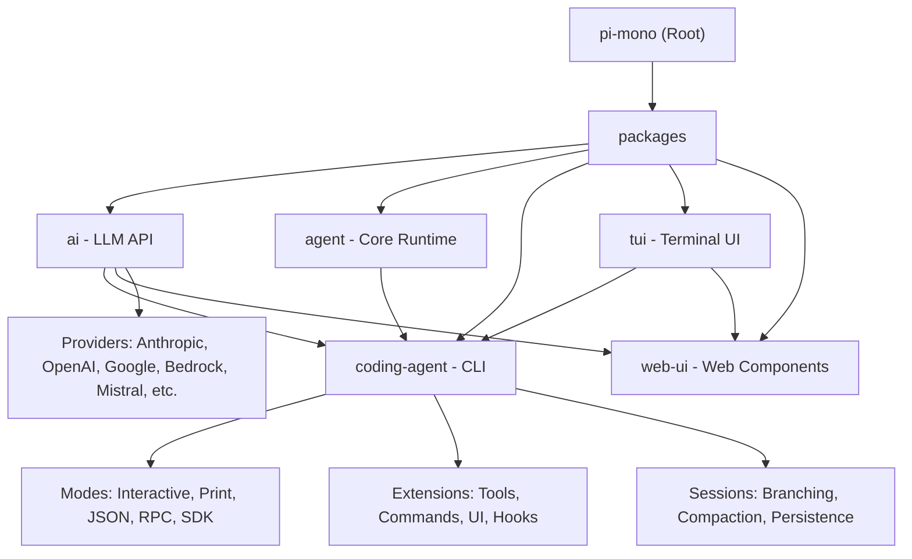

# Pi Monorepo - AI Coding Agent Platform

> **Last Updated:** 2026-05-04 08:50:13 CST
> **Version:** 0.72.1
> **Documentation Status:** Phase 1 Complete - Root Level Overview
> **Coverage:** 5 packages | TypeScript monorepo | MIT License

---

## Project Vision

Pi is a minimal, aggressively extensible AI coding agent platform that prioritizes user control and workflow adaptability over built-in features. The project provides a comprehensive toolkit for building AI agents with unified multi-provider LLM support, terminal UI capabilities, and a powerful extension system.

**Core Philosophy:** Features that other tools bake in can be built with extensions, skills, or third-party packages. This keeps the core minimal while letting users shape pi to fit their workflow.

**Key Design Principles:**
- **No MCP** - Build CLI tools with READMEs (Skills) or extensions
- **No sub-agents** - Spawn pi instances via tmux or build custom solutions
- **No permission popups** - Use containers or build custom confirmation flows
- **No plan mode** - Write plans to files or build via extensions
- **No built-in to-dos** - Use TODO.md files or custom extensions
- **No background bash** - Use tmux for full observability

---

## Architecture Overview

Pi is a TypeScript monorepo built on npm workspaces with 5 core packages:

```
pi-mono/
├── packages/
│   ├── ai/                 # Unified multi-provider LLM API
│   ├── agent/              # General-purpose agent runtime
│   ├── coding-agent/       # Interactive coding agent CLI (main product)
│   ├── tui/                # Terminal UI library with differential rendering
│   └── web-ui/             # Web components for AI chat interfaces
├── scripts/                # Build, release, and utility scripts
├── test.sh                 # Test runner (skips LLM-dependent tests)
└── pi-test.sh             # Run pi from sources
```

**Technology Stack:**
- **Language:** TypeScript 5.7+ (target ES2022)
- **Runtime:** Node.js 20.0.0+
- **Build:** tsgo (TypeScript compiler wrapper)
- **Package Manager:** npm workspaces
- **Testing:** Vitest
- **Quality:** Biome (linting/formatting), TypeScript strict mode
- **CI:** GitHub Actions

**Key Dependencies:**
- **LLM Providers:** @anthropic-ai/sdk, openai, @google/genai, @mistralai/mistralai, @aws-sdk/client-bedrock-runtime
- **Terminal:** chalk, cli-highlight, diff, marked (markdown)
- **Web:** lit, @mariozechner/mini-lit, lucide (icons)
- **Utilities:** typebox, zod-to-json-schema, yaml, uuid, minimatch, glob

---

## Module Structure Diagram



---

## Module Index

| Package | Version | Description | Language | Entry Point | Tests |
|---------|---------|-------------|----------|-------------|-------|
| **@mariozechner/pi-ai** | 0.72.1 | Unified multi-provider LLM API with automatic model discovery | TypeScript | `dist/index.js` | Vitest |
| **@mariozechner/pi-agent-core** | 0.72.1 | General-purpose agent runtime with tool calling and state management | TypeScript | `dist/index.js` | Vitest |
| **@mariozechner/pi-coding-agent** | 0.72.1 | Interactive coding agent CLI with read, bash, edit, write tools | TypeScript | `dist/cli.js` | Vitest |
| **@mariozechner/pi-tui** | 0.72.1 | Terminal UI library with differential rendering | TypeScript | `dist/index.js` | Node test |
| **@mariozechner/pi-web-ui** | 0.72.1 | Web components for AI chat interfaces | TypeScript | `dist/index.js | Biome |

---

## Running and Development

### Quick Start

```bash
# Install dependencies
npm install

# Build all packages
npm run build

# Run linter, formatter, and type checker
npm run check

# Run tests (skips LLM-dependent tests without API keys)
./test.sh

# Run pi from sources (can be run from any directory)
./pi-test.sh

# Development mode (starts all packages in watch mode)
npm run dev
```

### Development Workflow

```bash
# Individual package development
cd packages/ai && npm run dev          # Watch mode for ai package
cd packages/coding-agent && npm run dev # Watch mode for coding-agent
cd packages/tui && npm run dev          # Watch mode for tui
cd packages/web-ui && npm run dev       # Watch mode for web-ui

# Type checking with compiler
npm run dev:tsc                         # TypeScript watch mode

# Profile coding-agent performance
npm run profile:tui                     # Profile TUI mode
npm run profile:rpc                     # Profile RPC mode
```

### Running Tests

```bash
# Run all tests
npm test

# Run specific test file
cd packages/coding-agent
npx tsx ../../node_modules/vitest/dist/cli.js --run test/specific.test.ts

# Run tests without API keys (default)
./test.sh

# Run with specific provider (requires API keys)
BEDROCK_EXTENSIVE_MODEL_TEST=1 npm test
```

### Building for Production

```bash
# Build all packages
npm run build

# Prepare for publishing
npm run prepublishOnly  # Runs clean, build, and check

# Publish to npm
npm run publish         # Publishes all packages
npm run publish:dry     # Dry-run publication

# Build binary (experimental)
cd packages/coding-agent
npm run build:binary
```

---

## Testing Strategy

### Test Organization

**Test Structure:**
- `packages/*/test/*.test.ts` - Package-specific unit tests
- `packages/coding-agent/test/suite/` - Integration test suite
- `packages/coding-agent/test/suite/regressions/` - Issue-specific regression tests
- `packages/coding-agent/test/suite/harness.ts` - Test harness with faux provider

### Test Guidelines

**From AGENTS.md:**
- Use `test/suite/harness.ts` plus the faux provider
- Do NOT use real provider APIs, real API keys, or paid tokens
- Run tests from package root, not repo root
- Name regression tests: `<issue-number>-<short-slug>.test.ts`
- Always run tests after creating/modifying them

**Environment Setup:**
```bash
# test.sh automatically:
# 1. Backs up ~/.pi/agent/auth.json
# 2. Unsets all API keys
# 3. Sets PI_NO_LOCAL_LLM=1
# 4. Runs npm test
# 5. Restores auth.json on exit
```

### Coverage Goals

- **Unit Tests:** Core logic, utilities, type transformations
- **Integration Tests:** Agent loops, tool execution, session management
- **Regression Tests:** Bug fixes must include regression tests
- **Provider Tests:** Mock only - no real API calls in test suite

---

## Coding Standards

### Code Quality Rules

**From AGENTS.md:**

1. **Type Safety:**
   - No `any` types unless absolutely necessary
   - Check node_modules for external API types
   - NEVER use inline imports (`import("pkg").Type`, dynamic imports)
   - NEVER remove code to fix type errors - upgrade dependencies instead

2. **Keybindings:**
   - All keybindings must be configurable
   - Add defaults to `DEFAULT_EDITOR_KEYBINDINGS` or `DEFAULT_APP_KEYBINDINGS`
   - NEVER hardcode key checks (e.g., `matchesKey(keyData, "ctrl+x")`)

3. **Generated Files:**
   - NEVER modify `packages/ai/src/models.generated.ts` directly
   - Update `packages/ai/src/scripts/generate-models.ts` instead

4. **Commit Standards:**
   - No emojis in commits, issues, PR comments, or code
   - Technical prose only, be kind but direct
   - Use `fixes #<number>` or `closes #<number>` to auto-close issues

### Development Commands

```bash
# After code changes (NOT documentation changes):
npm run check  # Fix all errors, warnings, and infos before committing

# Commands to NEVER run (per AGENTS.md):
npm run dev    # Use individual package dev instead
npm run build  # Use individual package build instead
npm test       # Use ./test.sh instead
```

### Contribution Guidelines

**Quality Bar:**
- Understand your code - explain what changes do and how they interact
- AI-generated code is fine if reviewed and understood
- Run from repo root to pick up AGENTS.md automatically
- All contributions must pass `npm run check` and `./test.sh`

**Issue Labels:**
- `pkg:agent` - Agent package issues
- `pkg:ai` - AI package issues
- `pkg:coding-agent` - Coding agent package issues
- `pkg:tui` - TUI package issues
- `pkg:web-ui` - Web UI package issues

---

## AI Usage Guidelines

### Context Files

**Automatic Loading (disable with `--no-context-files`):**
- `~/.pi/agent/AGENTS.md` (global)
- `~/.pi/agent/CLAUDE.md` (global)
- Parent directories (walking up from cwd)
- Current directory: `.pi/AGENTS.md`, `.pi/CLAUDE.md`

**System Prompt Replacement:**
- `.pi/SYSTEM.md` (project) - Replaces default prompt
- `~/.pi/agent/SYSTEM.md` (global) - Replaces default prompt
- `APPEND_SYSTEM.md` - Appends without replacing

### Best Practices for AI Agents

1. **Run from pi-mono root** - Ensures AGENTS.md is loaded automatically
2. **Follow AGENTS.md rules** - All agents must respect project-specific rules
3. **Understand generated code** - Don't commit code you don't understand
4. **Test after changes** - Run `npm run check` and relevant tests
5. **Use issue-specific tests** - Add regression tests for bug fixes

### Agent-Specific Rules

**When Working on This Project:**
- Always read AGENTS.md before starting work
- Never run `npm run dev`, `npm run build`, or `npm test` from root
- Use package-specific commands for development
- All keybindings must be configurable
- Never modify generated files directly
- Understand code before committing

---

## Key Technical Concepts

### Session Management

**Sessions are JSONL files with tree structure:**
- Each entry has `id` and `parentId`
- In-place branching without creating new files
- Auto-save to `~/.pi/agent/sessions/` organized by working directory
- Support for `/tree` (navigate), `/fork` (new from point), `/clone` (duplicate active)

**Compaction:**
- Manual: `/compact [custom instructions]`
- Automatic: Triggers on context overflow or approaching limit
- Lossy but preserves full history in JSONL
- Use `/tree` to revisit compacted history

### Provider System

**Supported Providers (35+):**
- Subscriptions: Anthropic, OpenAI, GitHub Copilot
- API Keys: Anthropic, OpenAI, Azure OpenAI, DeepSeek, Google, Vertex, Bedrock, Mistral, Groq, Cerebras, xAI, OpenRouter, and more
- Custom providers via `~/.pi/agent/models.json`

**Model Discovery:**
- Automatic model discovery for each provider
- Updated with every release
- Tool-capable models identified automatically
- Custom models via JSON configuration

### Extension System

**Extension Capabilities:**
- Custom tools (or replace built-in tools)
- Commands (`/mycommand`)
- Keyboard shortcuts
- Event handlers (tool_call, message_start, etc.)
- UI components (editors, widgets, status lines)
- Custom providers and OAuth
- Sub-agents, plan mode, permission gates
- Git checkpointing, SSH, sandbox execution
- MCP server integration

**Extension Locations:**
- `~/.pi/agent/extensions/` (global)
- `.pi/extensions/` (project)
- Pi packages (npm/git)

### Skill System

**Agent Skills Standard:**
- Markdown files with frontmatter
- Invoke via `/skill:name` or auto-load
- Located in: `~/.pi/agent/skills/`, `.agents/skills/`, `.pi/skills/`
- Structured steps, conditions, and examples
- Shareable via pi packages

---

## Common Workflows

### Adding a New LLM Provider

1. **Core Types** (`packages/ai/src/types.ts`):
   - Add API identifier to `Api` union
   - Create options interface extending `StreamOptions`
   - Add mapping to `ApiOptionsMap`
   - Add provider name to `KnownProvider` union

2. **Provider Implementation** (`packages/ai/src/providers/`):
   - Create provider file with `stream<Provider>()` function
   - Implement message/tool conversion
   - Emit standardized events (text, tool_call, thinking, usage, stop)

3. **Exports and Registration** (`packages/ai/src/index.ts`, `register-builtins.ts`):
   - Add package subpath export in `package.json`
   - Add `export type` re-exports in `index.ts`
   - Register via lazy loader in `register-builtins.ts`
   - Add credential detection in `env-api-keys.ts`

4. **Model Generation** (`packages/ai/scripts/generate-models.ts`):
   - Add model definitions
   - Run `npm run generate-models`

5. **Tests** (`packages/ai/test/providers/<provider>.test.ts`):
   - Mock provider tests (no real API calls)
   - Error handling tests
   - Message conversion tests

### Creating an Extension

```typescript
// Extension factory (can be async)
export default function (pi: ExtensionAPI) {
  // Register custom tool
  pi.registerTool({
    name: "deploy",
    description: "Deploy to production",
    inputSchema: {
      type: "object",
      properties: {
        environment: { type: "string" },
      },
    },
    async execute(input, context) {
      // Deployment logic
      return { success: true };
    },
  });

  // Register command
  pi.registerCommand("stats", {
    description: "Show statistics",
    handler: async (context) => {
      // Show stats
    },
  });

  // Event handler
  pi.on("tool_call", async (event, ctx) => {
    // React to tool calls
  });
}
```

### Debugging Session Issues

```bash
# View session info
pi
/session  # Shows session file, ID, messages, tokens, cost

# Navigate session tree
/tree    # Jump to any point, view branches

# Export session for inspection
/export session.html

# Share session for debugging
/share   # Creates GitHub gist with HTML link
```

---

## Troubleshooting

### Common Issues

**Build Failures:**
```bash
# Clean and rebuild
npm run clean
npm run build

# Check for type errors
npx tsc --noEmit
```

**Test Failures:**
```bash
# Ensure no API keys are set
unset ANTHROPIC_API_KEY OPENAI_API_KEY GEMINI_API_KEY

# Run with verbose output
npm test -- --reporter=verbose
```

**Session Issues:**
```bash
# Backup and inspect session
cp ~/.pi/agent/sessions/session.jsonl session-backup.jsonl

# Start fresh session
pi --no-session

# Resume specific session
pi --session <session-id>
```

**Extension Loading:**
```bash
# Reload extensions, skills, prompts, context files
pi
/reload

# Check loaded extensions
/session  # Shows loaded resources in header
```

---

## Performance Considerations

**Token Optimization:**
- Prompt caching (Anthropic: 5 min, extended: 1h)
- Compaction to manage context overflow
- Efficient differential rendering in TUI

**Build Performance:**
- `tsgo` for fast TypeScript compilation
- Watch mode for development
- Parallel builds via `concurrently`

**Runtime Performance:**
- Event-driven architecture
- Lazy provider loading
- Efficient session storage (JSONL)
- Differential TUI rendering

---

## Security Notes

**API Key Storage:**
- Stored in `~/.pi/agent/auth.json`
- Never committed to git
- OAuth tokens supported
- Environment variable fallback

**Pi Packages:**
- Run with full system access
- Review source code before installing
- Extensions execute arbitrary code
- Skills can instruct model to perform any action

**Sandboxing:**
- Use containers for untrusted work
- Build custom permission gates via extensions
- Run in controlled environments

---

## Project Metadata

**Repository:** https://github.com/badlogic/pi-mono
**Website:** https://pi.dev
**Discord:** https://discord.com/invite/3cU7Bz4UPx
**License:** MIT
**Maintainer:** Mario Zechner (@badlogic)

**Related Projects:**
- **pi-share-hf:** Share OSS coding agent sessions
- **pi-chat:** Slack/chat automation
- **openclaw/openclaw:** Real-world SDK integration

---

## Changelog

### 2026-05-04 08:50:13 CST

**Initial Documentation Generation:**
- Created root-level CLAUDE.md with comprehensive project overview
- Documented all 5 packages with version information
- Added Mermaid module structure diagram
- Included development workflow and testing strategies
- Documented AI usage guidelines and coding standards
- Added troubleshooting and performance sections

**Next Steps:**
- Generate package-level CLAUDE.md files for each module
- Complete detailed API documentation
- Add more code examples and workflows
- Expand testing strategy documentation

---

*This documentation was auto-generated as part of the AI context initialization process. For detailed package-specific documentation, see individual package CLAUDE.md files.*
